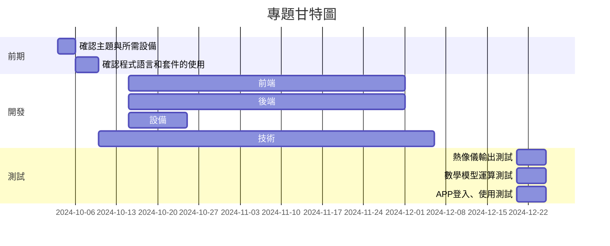
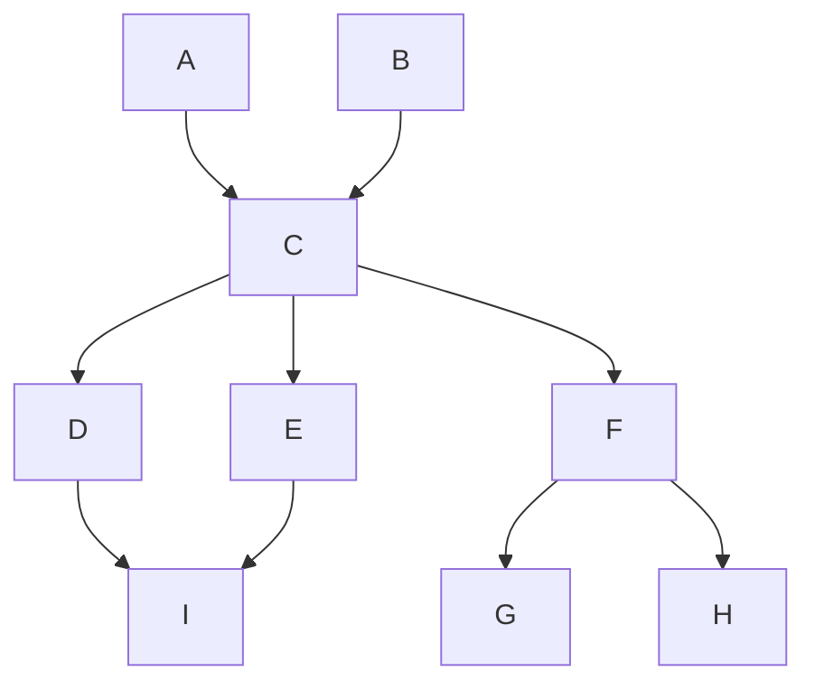

#### A:確認主題與所需設備	
#### B:確認程式語言和套件的使用	
#### C:技術開發: 辨識衣服材質及數學運算	
#### D:前端: 用 .NET 撰寫 APP	
#### E:後端: 資料庫建置	
#### F:設備: 熱像儀設定使用	
#### G:熱像儀輸出測試	
#### H:數學模型運算測試	
#### I:APP 登入、使用測試
#### 關鍵路徑:A → B → C → D → G/I（H）
